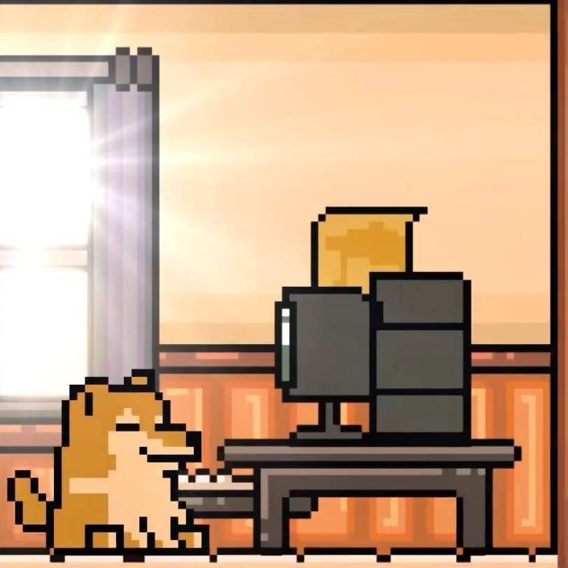

# ¡Hola, 2022! &nbsp; ¡Adiós 2021!
## **Here is a sanctuary cube for the poor cheems who suffered from bioinfomatics lovesick syndrome.** 
### If cheems chase after you and wags its tail, it means affection for you.
### Do not be afraid. You could play with it. It never bites or barks.
------

<strong>Say: Thank you, cheems.</strong>

# Personal information
<table border="0">
  <tr>
    <td width="60%">
     <h1> 
Name: Jiayi Guo
</h1>
      
<b>Year 2, Bioinformatics</b>

      
<b>Age ：20</b>

      
<b>Gender ：???(A secret makes a woman woman)</b>

      
<b>Locate: Department of Biological Sciences, Xi'an Jiaotong-Liverpool University</b>

      
<b>Email：Jiayi.GUO20@student.xjtlu.edu.cn</b>

      
<b>Wechat：kaliumkwok</b>

      
<b>If you have any academic related issues，please feel free to communicate with me.</b>

    </td>
    <td width="40%">
           
    </td>
  </tr>
</table>

# Research interests
 - Machine learning 
 - Health data science
 - Public health
 - Biostatistics
 - Natural language processing
 - Medical imaging
 - Data visualization
 - Genomics
 - Law and Social Science（maybe？）

# Research/Competition experiences
-	National Second Prize, CUMCM（Contemporary Undergraduate Mathematical Contest in Modeling）
- Third Prize, APMCM（Asia and Pacific Mathematical Contest in Modeling）
- Second prize, XJTLU research-oriented learning competition
-	《Maize (Zea mays L.) root elongation and anatomy revealed the reduced toxicity of Cd under Se amendment at molar ratio 1:1》, Annals of Botany，SCI journal zone 2，Seventh author
-	Research volunteer, Environmental Chemistry Laboratory of Xi'an Jiaotong-Liverpool University,16s rDNA microbiome data analysis (qiime2, LefSe, linux)
-	Two papers researched on the supplier's supply capability evaluation system are currently being revised under the guidance of Prof. Niu and Prof. Ma. It is expected to be completed next year and submitted to the corresponding EI journal.
- Formal Surf Fellow, Assessment of iodine status, iodine knowledge and iodine concentration in household salt among adults living in Yangtze River Delta region, Department of Health and Environmental Sciences, Xi'an Jiaotong-Liverpool University
- Product testing & data research intern，Youxing Health Technology Co., Ltd., Suzhou Artificial Intelligence Industrial Park
- Member of the project team, Natural Language Processing (Medical Data), School of Communication and Electronic Engineering, East China Normal University & Plateau School of Medicine, Tibet University
- Member of the project team, Android app development (a supporting app for smart wearable devices that assist medical imaging and ultrasound diagnosis), School of Communication and Electronic Engineering, East China Normal University

# Social activity 
-	President of Law Society, XJTLU(Previous)；
-	Minister of Academics,iGEM club, XJTLU(Previous)；
-	Researcher, Scientific Research Center, Science and Innovation Association (Previous)
-	HP volunteer, XJTLU-CHINA, 2021
-	Student Representative of bioinformatics in the Council of Schools of Science of Xi'an Jiaotong-Liverpool University (SSLC),2021-2022;
-	Personal experiences and stories have been published on the WeChat public account of "XJTLU Admissions".
-	Senior mentor, Xi'an Jiaotong-Liverpool University Affiliated School

# Interesting experience in 2021
<table border="10">
  <tr>
    <th>Issues</th>
    <th>Details</th>
  </tr>
  <tr>
    <td>The number of my WeChat friends has skyrocketed</td>
    <td>The sum of my friends have broken through 1100, I also have an extra nickname "Dog Bro"</td>
    </tr>
  <tr>
    <td>An "a'ba" qq group was established</td>
    <td>I shared a lot of learning materials, answer others' questions, and I made many good friends.</td>
  </tr>
   <tr>
    <td> Strongly fought against Wenhui Property and wrote a lot of things to criticize the phenomenon</td>
    <td>I was interviewed by the University Administration Teacher five times in total.</td>
  </tr>
   <tr>
    <td>Established Rhizomyidae Studio</td>
    <td>We created a failed pixel story game during the winter vacation, and then we had the idea of ​​making the game. Although we got the team up, the plan was aborted, but there are still videos and posters left.</td>
  </tr>
     <tr>
    <td>Rebuilt the XJTLU Law Society</td>
    <td>Pain but happy!!!</td>
  </tr>
     <tr>
    <td>Wrote a 347-page essay on social practice during winter vacation, but social practice did not win any awards.</td>
    <td>We used this paper to participate in a research-oriented learning contest, but instead won the second prize and a prize of 3,000 yuan.</td>
  </tr>
     <tr>
    <td>I confessed the sci-hub goddess Alexandra Elbakyan on Qixi Festival and donated 52.0 yuan.</td>
    <td>removing barriers on the way of science!!!</td>
  </tr>
     <tr>
    <td>The TOEFL test was postponed five or six times from the summer vacation</td>
    <td>In the end I simply cancelled it.</td>
  </tr>
     <tr>
    <td>Participated in the preaching activity of the Institute of Neurology of the Chinese Academy of Sciences</td>
    <td>Obtained a custom red T-shirt from the Chinese Academy of Sciences mailed from Shanghai</td>
  </tr>
  <tr>
    <td>Apply for the Tsinghua Neuroscience Laboratory Summer School</td>
    <td>I was rejected, but the other party provided me with a complete recording and broadcasting class (although I did not watch it in the end)</td>
  </tr>
  <tr>
    <td>A website was reorganized for the Law Society (because the articles posted in the official account are always "harmonized")</td>
    <td>The website was abandoned after more than a month</td>
  </tr>
  <tr>
    <td>Participated in the preaching activity of the Institute of Neurology of the Chinese Academy of Sciences</td>
    <td>Obtained a custom red T-shirt from the Chinese Academy of Sciences mailed from Shanghai</td>
  </tr>
   <tr>
    <td>In order to help everyone review CCT008, the Law Society has published hundreds of pages of information.I printed 800 copies because I wanted more people to read it</td>
    <td>The driver delivered it to the wrong place and sent it to Wuxi together with the information from the Mathematics Club.</td>
  </tr>
    <tr>
    <td>Before the exam, a CCT008 Q&A group was established to help others organize information and answer questions.</td>
    <td>Someone said thanks.</td>
  </tr>
    <tr>
    <td>I regret losing an orange cat forever because of my mistakes.</td>
    <td>Irretrievable</td>
  </tr>
   <tr>
    <td>Carried out rights protection activities, established rights protection wechat groups</td>
    <td>helped XJTLU students solve dozens of cases</td>
  </tr>
   <tr>
    <td>I contacted the four presidents of Communication Society, Chinese Debating Club, Law Society and History Club, and co-organized the Magic Academy Cup competition.</td>
    <td>Unprecedented in history, I feel very proud</td>
  </tr>
  <tr>
    <td>I successfully completed the review materials for seven courses in the Department of Biology, and friends from the Department of Biology sent me several hundred yuan hongbao.</td>
    <td>I love my dokidoki biology family members all!!!</td>
  </tr>
  <tr>
    <td>I succeeded in persuading Professor Wang to change her plan for the offline closed-book examination and turned it into an online open-book</td>
    <td>Save countless biology students from possible low marks/td>
  </tr>
  <tr>
    <td>Planned an event thanking Professor Ferdinand</td>
    <td>He posted the gifts we gave him outside the office, he received our greeting cards and took a photo with us/td>
  </tr>
    <tr>
    <td>I helped a lot of people</td>
    <td>But I can't remember the details/td>
  </tr>
      <tr>
    <td>…… </td>
    <td>…… </td>
  </tr>
</table>
    
    
## Skill list
- Ps: Make all kinds of weird emoticons
- Pr：Editing and making videos, since I used to be a Bilibili uploader.
- Id: A two-hundred-page book of final review materials for the club has been typeset by using it.
- Ai：A surf posters was made by it
- html：This website is built by using html and markdown.
- Python: Data cleaning, analysis, visualization，deep learning（Still learning）
- R:Process the statistics of biological data and draw graph, I have taken the course "Statistics and R" on edx before
- Linux:The Ubantu virtual machine has been installed on the computer and used it to process microbiome data during the summer.
- Strange talent: maybe a lot...

## Future outlook
- Study more than a dozen courses in edx and coursera, complete two to three series of certificates, and make up all unsatisfied prerequisites for the Master of Data Science.
- Keep learning mathematical modeling and data processing during winter vacation. Strive for a higher prize!
- Kaggle practice hard, and strive for the silver medal next year
- Write, revise, and improve the EI papers to be published next year
- Hope to pass the final interview and successfully enter the iGEM team of XJTLU
- Complete the tasks currently received in the project team, process the experimental data of the Tibet University School of Medicine, and study the fatigue speech recognition(Natural Language Processing) 
- Get more certificates, and learn more skills (regardless of whether it comes in handy)
- Become more mature and confident
------
## Thanks for your time and consideration for reading，also thank for the WeChat Moments that I have sent over the past year, which made me discover that I have so many memories to recall.    
